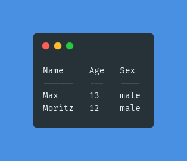
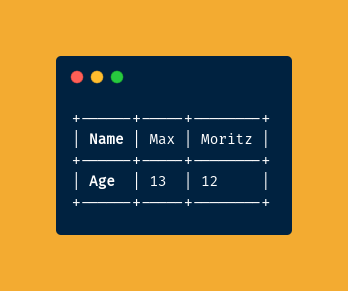

# V Terminal Tables


Simple and highly customizable library to display tables in the terminal.


## Features
- Choose from seven predefined [styles](#predefined-styles)
- Or create any [custom style](#creating-custom-styles) you want
- [Tab support](#tabsize)
- [Unicode support](test/../tests/unicode/cjk.out)


## Installation
`v install serkonda7.termtable`


## Usage
```v
import serkonda7.termtable as tt

fn main() {
	data := [
		['Name', 'Age', 'Sex'],
		['Max', '13', 'male'],
		['Moritz', '12', 'male'],
		['Lisa', '42', 'female'],
	]
	t := tt.Table{
		data: data
		// The following settings are optional and have these defaults:
		style: .grid
		header_style: .bold
		align: .left
		orientation: .row
		padding: 1
		tabsize: 4
	}
	println(t)
}
```


### Predefined Styles
Supported values for `style: ...` are:
- .grid
- .pretty
- .plain
- .simple
- .fancy_grid
- .md
- .rst

`.grid` (default):


`.pretty`:


`.plain`:


`.simple`:


`.fancy_grid`:


`.md` follows the conventions of [Markdown][md-tables]. It does not add alignment colons though:


`.rst` behaves like the [reStructuredText][rst-tables] simple table format:


### Header Style
```v
// header_style: ...
```
| `.bold (default)` | `.plain` |
| :-------: | :-------: |
|  |  |


### Alignment
```v
// align: ...
| Max    | 13  | male   |  // .left (default)
|  Max   | 13  |  male  |  // .center
|    Max |  13 |   male |  // .right
```


### Orientation
```v
t := tt.Table{
	data: [
		['Name', 'Age'],
		['Max', '13'],
		['Moritz', '12'],
	]
	// orientation: ...
}
println(t)
```
| `.row (default)` | `.column` |
| :-------: | :-------: |
|  |  |


### Padding
Control the count of spaces between the cell border and the item.
```v
// padding: ...
|   Lisa   |   42   |   female   |  // 3

| Lisa | 42 | female |  // 1 (default)

|Lisa|42|female|  // 0
```


### Tabsize
```v
t := tt.Table{
	data: [
		['\tName', 'Sex'],
		['1.\tMax', 'male\t'],
		['2. \tMoritz', '\tmale'],
	]
	// tabsize: ...
}
println(t)
```

| `4 (default)` | `2` | `8` |
| :-------: | :-------: | :-------: |
|  |  |  |


### Creating Custom Styles
To create a custom style set the tables style property to `style: .custom`
and specify `custom_style: tt.StyleConfig{...}`.

#### `StyleConfig` Struct
```v
topline      tt.Sepline{...}
headerline   tt.Sepline{...}
middleline   tt.Sepline{...}
bottomline   tt.Sepline{...}
colsep       string
fill_padding bool = true
```

#### `Sepline` Struct
```v
left  string
right string
cross string
sep   string
```


## Acknowledgements
- Images were made with [carbon][carbon-repo] and optimized with [image-actions][image-actions-repo]


## License
Licensed under the [MIT License](LICENSE.md)


<!-- Links -->
[md-tables]: https://www.markdownguide.org/extended-syntax#tables
[rst-tables]: https://docutils.sourceforge.io/docs/user/rst/quickref.html#tables
[carbon-repo]: https://github.com/carbon-app/carbon
[image-actions-repo]: https://github.com/calibreapp/image-actions
